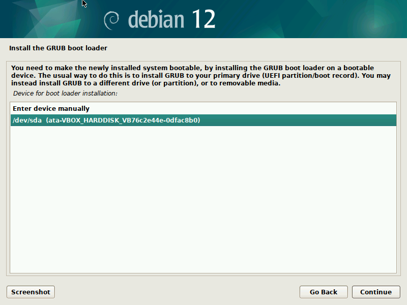
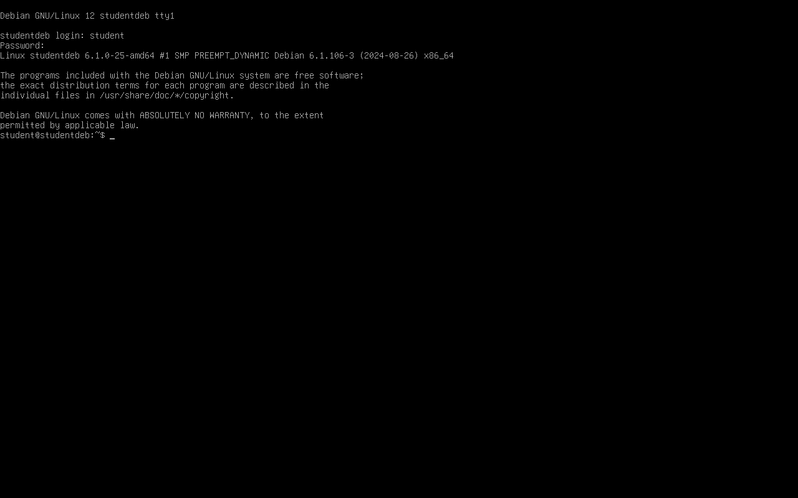

## Linux-distributie installeren: Debian

Vooraleer we met de cursus starten, moeten we een **Linux-distributie installeren**.  

Omdat doorgaans de meeste studenten als besturingssysteem **Windows** of **macOS** gebruiken, maken we in deze cursus gebruik van Linux in een virtuele machine. We doen dit met **VirtualBox**.

> Mocht je ervaring hebben of voorkeur geven aan een andere virtualisatietechnologie
> (Qemu, VMware, Parallels, ...) mag dit ook. Maar dan kan de lector minder hulp bieden.

### Opzetten van een virtuele machine met VirtualBox

We installeren voor de cursus de Linux-distributie **Debian** (<https://www.debian.org>) in een virtuele machine.

#### Debian downloaden

We moeten eerst een installatiebestand van een Linux-distributie downloaden. We maken gebruik van Debian 12 (bookworm). Ga hiervoor naar de website <https://www.debian.org> en klik op de knop **Download**.

De download neemt +- 630 MB in beslag. Het betreft hier een ISO-image die een minimale installatie voorziet van Debian. Hou er dus rekening mee dat je tijdens de installatie nog een internetverbinding nodig hebt omdat er dan extra software gedownload wordt.

#### VirtualBox installeren

VirtualBox is vrij beschikbaar voor Windows, macOS en Linux. Meer informatie en downloads vind je op <https://www.virtualbox.org/wiki/Downloads>. Installeer VirtualBox voordat je verdergaat.

#### VirtualBox Manager verkennen

Eenmaal VirtualBox geïnstalleerd is, start je het programma op via het **applicatiemenu** van je
besturingssysteem (Windows, macOS of Linux).

We zullen in deze cursus vanaf nu regelmatig verwijzen naar de **host** en **guest**:
 
* **Host** => Het besturingssysteem van je **computer** waarop je VirtualBox draait.
* **Guest** => Het besturingssysteem dat **in een virtuele machine binnen VirtualBox** draait.

VirtualBox kun je eigenlijk beschouwen als een programma dat een computer nabootst waarop je besturingssystemen draait.

Het hoofdvenster van VirtualBox is de **VirtualBox Manager**. Die geeft je een overzicht van de bestaande virtuele machines. Als je VirtualBox net geïnstalleerd hebt, zijn er vanzelfsprekend nog geen virtuele machines te zien.

Vanuit dit overzicht kun je deze **machines configureren en opstarten**.

#### Virtuele machine aanmaken

We starten met het aanmaken van een virtuele machine. Klik daarvoor op de knop **New** in de balk bovenaan of het menu **MAchine / New...** of de toetsencombinatie Ctrl+N.

Vul in het scherm dat verschijnt de volgende gegevens in:

* **Name**: bijvoorbeeld **studentdeb**
* **ISO image**: het iso-bestand van Debian dat je hiervoor gedownload hebt. Selecteer dit in je downloadmap.

Vink **Skip Unattended Installation** aan en klik dan op **Next** om te vervolgen.

Je **virtuele machine** zal een deel van het **geheugen** van je **host** innemen. In het volgende scherm dien je het **maximale RAM** (*random access memory*) in te voeren dat dit systeem mag innemen:

Als je host voldoende RAM (4 GB of meer) heeft, ken dan 2 GB toe aan de virtuele machine. Heeft je host minder RAM (minder dan 4 GB), dan mag je het RAM van de virtuele machine beperken tot 1 GB.

Het aantal processoren mag je beperken tot 1. Klik op **Next**.

#### Harde schijf aanmaken

Net zoals bij de installatie van een besturingssysteem op een fysieke
machine (pc, server, Raspberry Pi, ...) heb je een **harde schijf** of
**persistente opslag** nodig om gegevens op te slaan.

In het geval van een virtuele machine wordt deze schijf **geëmuleerd** (nagebootst) door
middel van een bestand, een **Virtual Hard Disk** en in het geval van VirtualBox een **VirtualBox Disk Image (VDI)**.

Kies de optie **Create a Virtual Hard Disk Now**:

Standaard maakt VirtualBox een virtuele harde schijf van 20 GB aan. Indien je dat niet beschikbaar hebt, maak dit dan kleiner, maar kies minstens 10 GB. Overigens wordt standaard niet deze maximale grootte onmiddellijk ingenomen. VirtualBox maakt het bestand waarin de virtuele harde schijf opgeslagen wordt pas groter naarmate de guest meer opslag nodig heeft.

Klik op **Next**. Vervolgens krijg je een overzicht van je nieuwe virtuele machine en klik je op **Finish** om die aan te maken.

Zoals je ziet, toont VirtualBox Manager je nu een **nieuwe virtuele machine**:

Je krijgt hier de eigenschappen van de machine te zien. Merk op: het iso-bestand is aangekoppeld als een **Optical Drive**. Dit bootst dus een cd-rom of dvd na.

Als je met de rechtermuisknop op de virtuele machine in VirtualBox Manager klikt en dan de optie 
optie "Show in File Manager" kiest, krijg je de bestanden te zien die aan deze virtuele machine zijn gekoppeld:

* **studentdeb.vdi** => virtuele harde schijf
* **studentdeb.vbox** => XML-bestand met de configuratie van de virtuele machine
* **studentdeb.vbox-prev** => vorige versie van de configuratie

In de praktijk hoef je niet met deze bestanden te werken; VirtualBox Manager regelt alles voor je.

We zijn nu (eindelijk) klaar om van start te gaan met de werkelijke
installatie...

### Debian installeren

Om je virtuele machine (en het installatieprogramma op de nagebootste cd-rom) te
starten, volstaat het om te dubbelklikken op het icoontje links of te klikken op het groene pijltje (**Start**) in de balk bovenaan.

Eenmaal de virtuele machine gestart is, kom je in het installatiescherm van Debian:

Hier kies je voor **Graphical install**. Dat doe je door gewoon op Enter te drukken, waarna de installatie start. De optie **Install** doet overigens hetzelfde, maar toont geen grafische interface.

Merk op: VirtualBox waarschuwt je dat de virtuele machine je toetsenbord en muis opeist wanneer je in het scherm van de virtuele machine bezig bent.

#### Locatie- en taalgegevens kiezen

De eerste stap is het selecteren van de taal. Kies voor **English**. Als je immers tijdens het werken met het Debian-systeem tegen foutmeldingen aanloopt, is het gemakkelijker om naar uitleg over Engelstalige foutmeldingen te zoeken dan naar de Nederlandstalige varianten.

Klik op **Continue**. In de volgende stap selecteer je je **locatie**. Dit is belangrijk om je tijdzone in te stellen. België staat niet in de lijst, dus selecteer **other** en klik op **Continue**:

Kies vervolgens voor **Europe** en klik op **Continue**. Dan kun je eindelijk **Belgium** als land selecteren:

Aan een taal wordt ook een "locale" gekoppeld die aanduidt welke variant
van de taal er gebruikt wordt. We houden het bij de standaardkeuze **United States** met de code **en\_US.UTF-8**:

Klik op **Continue**, waarna je je toetsenbordindeling kiest. Als je de standaard Belgische azerty-indeling gebruikt, kies je **Belgian**, anders wat op jouw toetsenbord van toepassing is:

Klik na de keuze van de toetsenbordindeling op **Continue**. Het installatieprogramma laadt dan bestanden van het installatiemedium en configureert dan het netwerk.

#### Hostname en gebruiker 

Je Debian-besuringssysteem heeft een **hostname** nodig, de naam waaronder de (virtuele) computer op het netwerk te vinden is. Kies hier de naam **studentdeb**.

Klik op **Continue**. Bij de **domain name** klik je gewoon op **Continue**.

Vervolgens dien je een wachtwoord te kiezen voor je **rootgebruiker**.  
Dit is een account waarmee je alle beheerdersrechten hebt (te vergelijken met Admin in Windows) en die je normaal gezien alleen gebruikt om je systeemconfiguratie te wijzigen of software te installeren.

Kies een wachtwoord dat je kunt onthouden. Je gaat dit immers waarschijnlijk niet elke dag invoeren, aangezien de lessen om de twee weken doorgaan...

Gezien het hier om een proefopstelling gaat, stelen we voor om als wachtwoord eenvoudigweg **student** in te stellen.

Waarschuwing: kies **nooit** zo'n eenvoudig wachtwoord voor productiedoeleinden op een echte Linux-machine.

Vervolgens vraagt het systeem je om een **standaardgebruiker** aan te maken. Deze gebruik je voor taken die geen rootrechten nodig hebben. Je geeft deze gebruiker achtereenvolgens een volledige naam (dat mag je eigen naam zijn), een gebruikersnaam (volledig in kleine letters) en een wachtwoord. Kies als gebruikersnaam **student** en als wachtwoord **student** (hetzelfde als bij root).

Waarschuwing: ook hier weer kiezen we alleen maar een eenvoudig wachtwoord zodat je dit niet zou vergeten. In de praktijk kies je een sterker wachtwoord en het liefst niet hetzelfde als het rootwachtwoord.

#### Harde schijf

In de volgende stappen geef je aan op welke harde schijf en hoe je Debian wilt installeren. Kies allereerst voor **Guided - use entire disk**:

In de volgende stap selecteer je de harde schijf. Dat is er maar één in onze virtuele machine, dus klik gewoon op **Continue**.

In de stap erna kies je of je afzonderlijke partities op de harde schijf wilt aanmaken. Kies de standaardkeuze **All files in one partition (recommended for new users)** en klik op **Continue**:

Het systeem stelt vervolgens een **overzicht** voor van wat het op de harde schijf zal aanpassen:

Als je met de standaardkeuze **Finish partitioning and write changes to disk** geselecteerd op **Continue** klikt, moet je bevestigen dat je deze wijzigingen naar de harde schijf wilt schrijven. Veiligheidshalve staat er standaard **No** geselecteerd. Selecteer **Yes** alvorens te bevestigen met **Continue**:

Daarna zal het installatieprogramma wijzigingen naar je (virtuele) harde schijf beginnen te schrijven...

#### Basissysteem installeren

Vervolgens start de installatie van het **base system**. Dat omvat alle software die nodig is voor het opstarten van een minimale Debian-installatie (zonder grafische gebruikersinterface):

Na deze installatie zal de installer vragen of er nog installatiemedia
zijn (extra CD's en/of USB-sticks). Hier mag je gewoon bij de standaardkeuze **No** op **Continue** klikken.

#### Pakketbeheerder configureren

Vele Linux-distributies werken met een **pakketbeheerder** (*package manager*) om software te installeren en te updaten.

Debians pakketbeheerder, APT (Advanced Package Tool), haalt de software die je installeert van online pakketbronnen (*repositories*). In de volgende twee stappen kies je een spiegelserver (*mirror*) waarvan de software gedownload wordt.

Als eerste stap selecteer je het **land** van waaruit je deze updates zal doen. Standaard staat hier het land dat je eerder al ingaf (**Belgium**). Doorgaans zullen downloads uit hetzelfde land sneller gaan.

Vervolgens krijg je een aantal keuzes voor spiegelservers. Kies er een. In de gebouwen van UCLL hebben we een rechtstreekse verbinding met Belnet, dus die zal hier waarschijnlijk het snelste zijn:

In de volgende stap krijg je de vraag of je een HTTP-proxy nodig hebt om met internet te verbinden. Laat dit leeg en klik op **Continue**. Alleen in sommige bedrijfsnetwerken moet je hier het adres van een proxy invoeren.

De installer gaat vervolgens op zoek naar beschikbare software. Ondertussen krijg je de vraag of je systeem statistieken mag doorsturen over welke pakketten geïnstalleerd worden. Het staat je vrij om dit al dan niet toe te staan, standaard staat dit op **No**. Klik dan op **Continue** om de volgende stap van de installatie te starten.

#### Software selecteren

We krijgen nu de vraag welke extra software we bovenop het basissysteem willen installeren. Standaard staan al **Debian desktop environment**, **GNOME** en **standard system utilities** ingeschakeld. Verwijder de vinkjes bij die eerste twee. Die maken deel uit van een grafische gebruikersinterface voor het besturingssysteem, waar we in deze cursus niet mee werken. Laat dus alleen **standard system utilities** aangevinkt staan en klik op **Continue** om deze te installeren:

#### Bootloader installeren (GRUB)

Een laatste - maar noodzakelijke - stap is het installeren van een
bootloader.  
Dat is software die - voordat het besturingssysteem (en kernel) wordt opgestart - een aantal noodzakelijke initialisaties doet.

Kies **Yes** (de standaardkeuze) om deze te installeren op je (virtuele) harde schijf en selecteer dan de harde schijf (**/dev/sda**):

Vervolgens wordt de bootloader geïnstalleerd...

#### Installatie beëindigen

Na het installeren van de bootloader is de installatie voltooid. Als je
nu op **Continue** klikt, zal de VM rebooten en zal Debian opstarten.

VirtualBox zal de installatie-CD/DVD automatisch -- bij de reboot -- verwijderen, zodat je niet per ongeluk de installer opnieuw opstart.

### Debian opstarten

Bij het opstarten zal eerst het GRUB-scherm verschijnen waar je de keuze
krijgt tussen Debian opstarten of extra boot-opties configureren:

Als je geen keuze maakt, wordt de standaardkeuze automatisch gemaakt en start Debian op. Daarna krijg je een sober inlogscherm. Vul achter **login:** de gebruikersnaam **student** in en achter **Password:** het wachtwoord **student**. Merk op: het wachtwoord wordt niet op het scherm getoond. Druk op Enter na het wachtwoord om aan te melden.

Na het inloggen kom je terecht in de shell, waarin we vanaf nu allerlei Linux-opdrachten kunnen typen:

