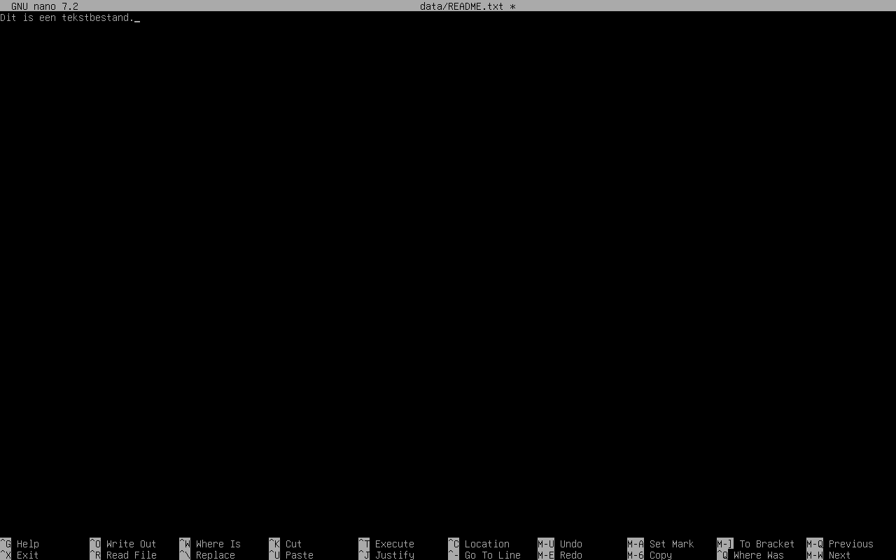

#### Tekstbestanden aanmaken, openen of bekijken

Tot nu toe hebben we bestanden aangemaakt met `touch`, maar die opdracht creëert gewoon een leeg bestand. Om tekst aan een (nieuw of bestaand) bestand toe te voegen, kun je de editor `nano` gebruiken:

~~~
nano data/README.txt 
~~~

Bestaat dit bestand nog niet, dan wordt het door `nano` aangemaakt.  
Bestaat het wel, dan leest `nano` de huidige inhoud in en kun je die wijzigen.

##### Werken met de interface van `nano`

Na het openen van een tekstbestand staat aan de bovenzijde links de versie van `nano`, in het midden de locatie van het geopende bestand, en rechts de term "Modified" indien het bestand door de gebruiker is aangepast.

Daaronder vind je de inhoud van het tekstbestand. Helemaal onderaan vind je een aantal sneltoetsen voor veel gebruikte acties, zoals het opslaan van en zoeken in het bestand, en het afsluiten van het programma.



Het teken `^` (caret, of dakje) staat voor de Ctrl-toets op het toetsenbord.  

In plaats van de Ctrl-toets kun je ook tweemaal op de Esc-toets drukken.  
Enkele andere sneltoetsen vind je in de helpinformatie (^G).

Verder kun je vrijuit typen en de pijltjestoetsen gebruiken om door het bestand te navigeren. Tussentijds opslaan doe je aan de hand van de WriteOut-sneltoets (^O). Onderaan vraagt de editor (File Name to Write) om de bestandsnaam te bevestigen. 
Als je het bestand onder een andere naam wilt opslaan, vul dan een andere naam in voor je bevestigt.

Zodra je nano afsluit met ^X, zul je gevraagd worden of je niet opgeslagen wijzigingen wilt opslaan of negeren.

##### Inhoud bekijken

Om de inhoud van een bestand te bekijken, kun je dit met nano openen. Maar dit is eigenlijk bedoeld om het bestand te bewerken. Als je niets wilt aanpassen, maar gewoon wilt zien wat er in het bestand staat, kun je de opdracht `cat` gebruiken met als argument de bestandsnaam:

~~~
student@studentdeb:~$ cat data/README.txt
Dit is een tekstbestand.
student@studentdeb:~$
~~~

### Oefening

Maak een bestand `~/oefening1/bestanden/leesmij.txt` aan en plaats daarin de volgende tekst:

```
Dit is een bestand met informatie over deze directory.
```

Kopieer dit bestand naar de directory `~/oefening1/kopie/README.txt`.

Toon de inhoud van beide bestanden om te controleren of ze effectief kopieën zijn.
